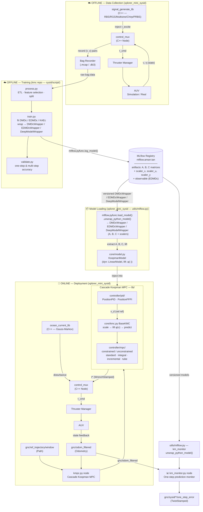
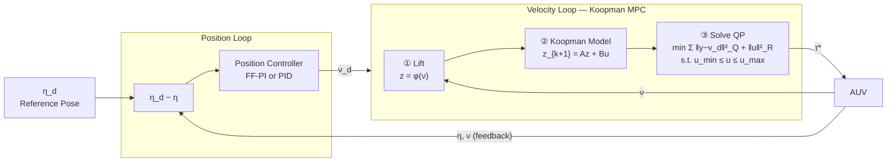
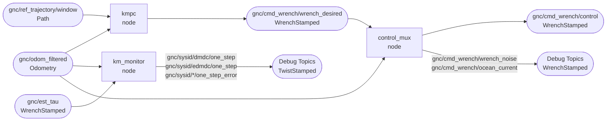
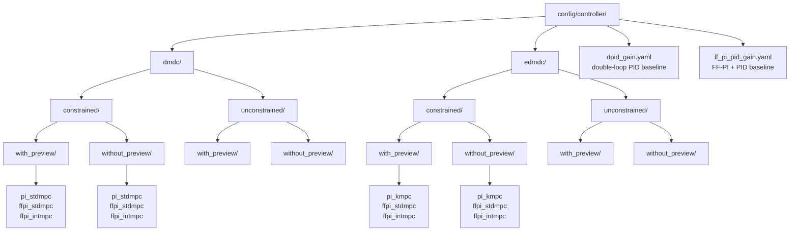

# xplorer_mini_sysid

System Identification and Koopman-based Model Predictive Control (KMPC) for the Xplorer Mini AUV.

---

## Overview

This package provides a **data-driven control pipeline** for the Xplorer Mini AUV. It uses **Koopman operator theory** to linearize the nonlinear AUV dynamics, then applies **Model Predictive Control (MPC)** in the lifted linear space. Models are trained offline and managed via **MLflow**.

### Full Pipeline

---

## Cascade Control Structure

---

## ROS2 Topic Graph

---

## Controller Variants

| Axis | Options |
|------|---------|
| **Model** | `dmdc` · `edmdc` |
| **Constraint** | `constrained` · `unconstrained` |
| **Preview** | `with_preview` · `without_preview` |
| **Position controller** | `pi` (PID) · `ff_pi` (feedforward PI) |
| **Velocity controller** | `pid` · `stdmpc` · `intmpc` · `kmpc` |

---

## Module Reference

---

### ROS2 Python Nodes

#### [`kmpc.py`](xplorer_mini_sysid/kmpc.py) — `CascadeKoopmanControl`

**Layer:** ROS2 Python Node

**Description:** Cascade controller combining a position outer loop (PID or FF-PI) with a Koopman MPC velocity inner loop. Subscribes to odometry and a reference trajectory window, computes optimal wrench via ACADOS QP solver at each timestep, and supports preview mode via virtual reference rollout.

**Publishes:**
- 1. `gnc/cmd_wrench/wrench_desired` (`WrenchStamped`) — optimal wrench τ*
- 2. `gnc/sysid/twist_desired` (`TwistStamped`) — velocity reference ν_d
- 3. `gnc/sysid/twist_error` (`TwistStamped`) — velocity tracking error ν_d − ν
- 4. `gnc/sysid/pose_error` (`PoseStamped`) — pose tracking error η_d − η

---

#### [`km_monitor.py`](xplorer_mini_sysid/km_monitor.py) — `KMMonitor`

**Layer:** ROS2 Python Node

**Description:** Online one-step prediction monitor. Time-synchronizes odometry and estimated wrench, then runs DMDc and EDMDc models forward one step to evaluate model prediction error in real time. Falls back to u = 0 if wrench topic times out (> 0.5 s).

**Publishes:**
- 1. `gnc/sysid/dmdc/one_step` (`TwistStamped`) — DMDc predicted ν_{k+1}
- 2. `gnc/sysid/edmdc/one_step` (`TwistStamped`) — EDMDc predicted ν_{k+1}
- 3. `gnc/sysid/dmdc/one_step_error` (`TwistStamped`) — DMDc prediction error
- 4. `gnc/sysid/edmdc/one_step_error` (`TwistStamped`) — EDMDc prediction error

---

### ROS2 C++ Nodes

#### [`control_mux`](src/control_mux.cpp)

**Layer:** ROS2 C++ Node

**Description:** Wrench multiplexer that merges controller output, excitation signal, and Gauss-Markov ocean current disturbance into a single command wrench. Records synchronized (τ, ν) pairs to bag during system identification.

**Publishes:**
- 1. `gnc/cmd_wrench/control` (`WrenchStamped`) — final command wrench τ_cmd
- 2. `gnc/cmd_wrench/wrench_noise` (`WrenchStamped`) — injected excitation component
- 3. `gnc/cmd_wrench/ocean_current` (`WrenchStamped`) — ocean current disturbance

---

#### [`signal_generate_lib`](src/signal_generate_lib.cpp)

**Layer:** C++ Library — used by `control_mux`

**Description:** Generates bounded excitation signals for open-loop system identification. Signal type and parameters configured via [`config/signal_config.yaml`](config/signal_config.yaml). Supports three injection modes: `open`, `closed`, `noise_injected`.

**Returns:**
- 1. Excitation wrench τ_excite injected into `control_mux` at each timestep

| Signal | Description |
|--------|-------------|
| `RBS` | Random Binary Signal — uniform random bounded steps |
| `RGS` | Random Gaussian Signal — Gaussian-distributed |
| `Multisine` | Sum of sinusoids with optimized crest factor |
| `Chirp` | Linear frequency sweep |
| `PRBS` | Pseudo-Random Binary Sequence |

---

#### [`ocean_current_lib`](src/ocean_current_lib.cpp)

**Layer:** C++ Library — used by `control_mux`

**Description:** Gauss-Markov stochastic model that generates time-varying ocean current disturbance. Configured via [`config/ocean_current_config.yaml`](config/ocean_current_config.yaml).

**Returns:**
- 1. Disturbance wrench τ_oc injected into `control_mux` at each timestep

---

### lib/core/

#### [`core/model.py`](xplorer_mini_sysid/lib/core/model.py)

**Layer:** lib/core

**Description:** Dataclass definitions for the Koopman model representation used throughout the control pipeline. `LinearModel` holds the discrete-time state-space matrices. `KoopmanModel` bundles the linear dynamics with a lifting function φ(·) and the input/output scalers loaded from MLflow.

**Returns:**
- 1. `LinearModel` — A ∈ ℝⁿˣⁿ, B ∈ ℝⁿˣᵐ, C ∈ ℝᵖˣⁿ, D (optional)
- 2. `KoopmanModel` — `dyn: LinearModel`, `lift: φ(·)`, `scaler_x`, `scaler_u`, `scaler_y`

---

#### [`core/kmc.py`](xplorer_mini_sysid/lib/core/kmc.py) — `BaseKMC`

**Layer:** lib/core

**Description:** Abstract base that resolves the correct lifting function from the loaded `kmc` wrapper type — identity for `DMDcWrapper`, polynomial observable for `EDMDcWrapper`, neural encoder for `DeepModelWrapper` — and assembles a unified `KoopmanModel` ready for the MPC solver.

**Returns:**
- 1. `KoopmanModel` — A, B, C matrices + lifting function φ(·) + scalers, resolved from `kmc.utils.model_wrapper`

---

#### [`core/params.py`](xplorer_mini_sysid/lib/core/params.py)

**Layer:** lib/core

**Description:** Dataclasses for MPC cost and constraint configuration. Both print a formatted summary table via `tabulate` on instantiation for easy debugging.

**Returns:**
- 1. `Weights` — Q (tracking), Qi (integral), R_abs (effort), R_rate (rate), P (terminal), S (cross-term)
- 2. `Bounds` — per-variable constraints: x_min/max, y_min/max, u_min/max, du_min/max, terminal

---

### lib/controller/

#### [`controller/pid/`](xplorer_mini_sysid/lib/controller/pid/)

**Layer:** lib/controller

**Description:** Classical PID controllers for both loops of the cascade structure. `PositionPIDController` and `PositionFFPIController` compute body-frame velocity reference ν_d from pose error, with optional feedforward η̇_ref and low-pass filter. `VelocityPIDController` computes wrench τ from velocity error. All support anti-windup and saturation bounds.

**Returns:**
- 1. `PositionPIDController.compute_control(η, η_d, dt)` → ν_d ∈ ℝ⁶
- 2. `PositionFFPIController.compute_control(η, η_d, dt, η̇_d)` → ν_d ∈ ℝ⁶ with feedforward
- 3. `VelocityPIDController.compute_control(ν, ν_d, dt)` → τ ∈ ℝ⁶

---

#### [`controller/mpc/`](xplorer_mini_sysid/lib/controller/mpc/)

**Layer:** lib/controller

**Description:** Koopman MPC solvers built on ACADOS. All variants take a `KoopmanModel` and solve a finite-horizon QP over the Koopman-lifted space. Terminal cost P is computed from DARE. Variants:

| Variant | Constraints | Formulation |
|---------|-------------|-------------|
| `ConstrainedStandardStateForm/OutputForm` | Yes | Standard QP, state or output tracking |
| `ConstrainedIntegralStateForm` | Yes | Augmented integrator state, eliminates steady-state error |
| `IncrementalStateForm/OutputForm` | Yes | Velocity form with Δu constraints |
| `UnconstrainedStateForm/OutputForm/IntegralStateForm` | No | Closed-form LQR solution |

**Returns:**
- 1. `compute_control(ν, ν_d_window)` → τ* ∈ ℝ⁶ — optimal wrench (clipped to ±200 N·m)

---

### lib/utils/

#### [`utils/controller.py`](xplorer_mini_sysid/lib/utils/controller.py) — Factory

**Layer:** lib/utils

**Description:** Factory functions that parse ROS2 parameter dictionaries from YAML config, build `Weights`/`Bounds` dataclasses, and instantiate the correct position or velocity controller variant. Also defines `Wrapper`, `PositionControllerType`, `VelocityControllerType` type aliases.

**Returns:**
- 1. `create_position_controller(**ros_params)` → `PositionPIDController` | `PositionFFPIController`
- 2. `create_velocity_controller(**ros_params)` → one of 8 MPC or PID controller variants

---

#### [`utils/mlflow.py`](xplorer_mini_sysid/lib/utils/mlflow.py)

**Layer:** lib/utils

**Description:** Loads a versioned model from the MLflow registry by name and version number, calls `mlflow.pyfunc.load_model().unwrap_python_model()` to retrieve the underlying `kmc` wrapper object with its A, B, C matrices and fitted scalers.

**Returns:**
- 1. `load_model(client, name, version)` → `DMDcWrapper` | `EDMDcWrapper` | `DeepModelWrapper`

---

#### [`utils/kinematic.py`](xplorer_mini_sysid/lib/utils/kinematic.py)

**Layer:** lib/utils

**Description:** AUV kinematics utilities following Fossen (2011). `cal_eta_err_with_ssa` computes 6-DOF pose error with Smallest Signed Angle (SSA) wrapping for orientation. `eulerang` builds the 6×6 body-to-world transformation matrix J(η) used to convert body-frame velocity to NED velocity.

**Returns:**
- 1. `cal_eta_err_with_ssa(η_ref, η)` → error ∈ ℝ⁶ (position error + SSA-wrapped orientation error)
- 2. `eulerang(φ, θ, ψ)` → J ∈ ℝ⁶ˣ⁶, R_zyx ∈ ℝ³ˣ³, T_zyx ∈ ℝ³ˣ³

---

#### [`utils/virtual.py`](xplorer_mini_sysid/lib/utils/virtual.py)

**Layer:** lib/utils

**Description:** Generates a horizon-length preview of velocity references ν̂_d(k…k+N) by rolling the outer-loop position controller forward in time over the reference trajectory window. Required for MPC preview mode to avoid one-step-ahead limitation of the cascade.

**Returns:**
- 1. `generate_virtual_reference_pid(...)` → ν̂_cmd_b_window ∈ ℝᴺˣ⁶
- 2. `generate_virtual_reference_ff_pi(...)` → ν̂_cmd_b_window ∈ ℝᴺˣ⁶ (with feedforward η̇_ref)

---

### notebook/ — Offline Tools

#### [`notebook/prediction.py`](notebook/prediction.py)

**Layer:** Offline Tool

**Description:** Evaluates one-step and multi-step prediction accuracy of Koopman models loaded from MLflow against held-out bag data. Computes RMSE per DOF and plots predicted vs. ground-truth trajectories.

**Returns:**
- 1. RMSE table — one-step and multi-step error per DOF
- 2. Prediction trajectory plots (ν̂ vs. ν_true per axis)

---

#### [`notebook/simulation.py`](notebook/simulation.py)

**Layer:** Offline Tool

**Description:** Closed-loop simulation of the full cascade Koopman MPC pipeline using the Koopman model as a plant substitute. Enables gain tuning and controller debugging without hardware or Gazebo.

**Returns:**
- 1. State trajectories η(t), ν(t)
- 2. Control input τ(t) and saturation analysis
- 3. Tracking error plots per DOF

---

#### [`notebook/pso.py`](notebook/pso.py)

**Layer:** Offline Tool

**Description:** Particle Swarm Optimization for automatic MPC weight tuning. Runs closed-loop simulation for each candidate weight set and minimizes a configurable tracking error objective (e.g., integral of squared error).

**Returns:**
- 1. Optimal Q, R weight matrices
- 2. PSO convergence curve

---

#### [`notebook/report.py`](notebook/report.py) / [`summary.py`](notebook/summary.py)

**Layer:** Offline Tool

**Description:** `report.py` generates a per-run performance report (tracking metrics, prediction error, control effort). `summary.py` aggregates results across multiple MLflow runs into a single comparison table for model selection.

**Returns:**
- 1. `report.py` → per-run metric report (HTML / figures)
- 2. `summary.py` → cross-run comparison table (RMSE, tracking error, model version)

---

## Launch Files

| File | Description |
|------|-------------|
| [`xplorer_mini_km_mpc.launch.py`](launch/xplorer_mini_km_mpc.launch.py) | Start KMPC controller |
| [`xplorer_mini_km_monitor.launch.py`](launch/xplorer_mini_km_monitor.launch.py) | Start one-step prediction monitor |
| [`xplorer_mini_control_mux.launch.py`](launch/xplorer_mini_control_mux.launch.py) | Start control mux with signal generator and ocean current |
| [`xplorer_mini_reference.launch.py`](launch/xplorer_mini_reference.launch.py) | Start reference trajectory node |
